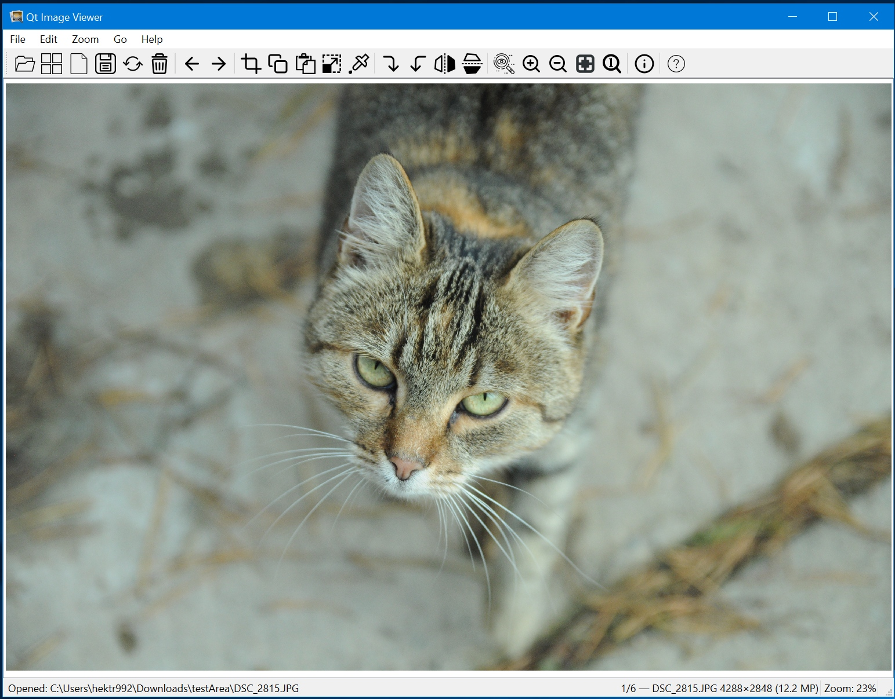
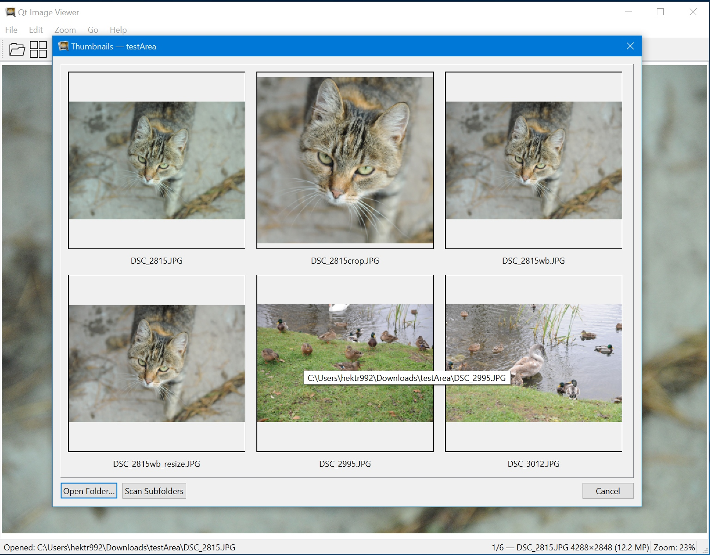
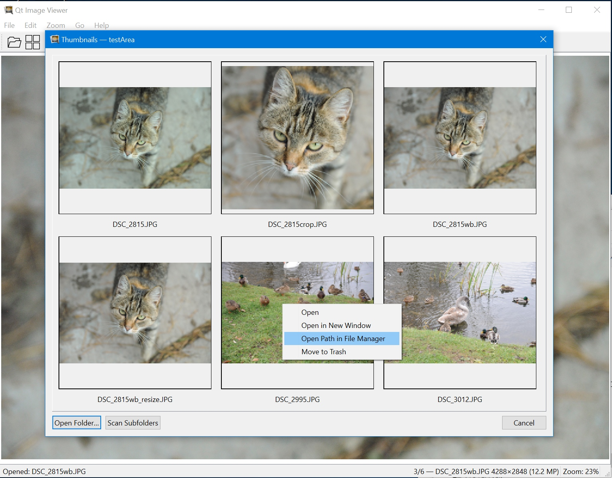

# Qt Image Viewer

Handy image viewer and editor built with PySide6. 
The latest version supports also windows (tested on windows 10, but should also on windows 11)

## Features

- **View photo/screenshots**: JPG/JPEG, WebP, PNG
- **Basic editing**: Rotate, flip, crop, copy/paste, resize 
- **White balance tool**: adjusting white balance by grey area of pic
- **Loupe tool**: shows area under cursor on its original size (256x256px by default)
- **Quality-controlled saving**: Save JPEGs with adjustable quality (default: 95), no unintended compression
- **Navigation**: Zoom in/out, fit to window, display at original size, and pan with arrow keys or middle mouse button
- **File browsing**: Navigate forward/backward through images in the same folder
- **EXIF metadata**: View image metadata in a dedicated panel
- **Thumbnails/Open Folder**: Dialog window with thumbnails (uses caching and threads)

## Hotkeys

# Navigation/Zooming/Panning
- **Navigation**: arrows or mouse wheel scrolling
- **Zooming in/out by mouse**: Ctrl+mouse wheel scrolling
- **Zooming in/out by keyboard**: + and -
- **Original size**: double click or =
- **Fit to window**: right click or w
- **Panning by mouse**: push down mouse wheel and move mouse
- **Panning by keyboard**: Ctrl+arrows
- **Loupe**: L 

    # Transformations
- **Rotate**: R and Shift+R
- **Flip**: F and Shift+F 

    # Editing
- **Selection/Crop tool**: Ctrl+X (select area by this tool and then press Enter to Crop or Ctrl+C to copy)
- **Copy/Paste**: Ctrl+C, Ctrl+V
- **White Balance**: B
- **Resize**: Ctrl+R

    # File operations
- **Move to trash**: Delete
- **Reload**: F5
- **Open Folder/Show thumbnails**: Ctrl+T
- **Open File**: Ctrl+O

    # Other
- **Cancel selected tool (crop/white balance/loupe)**: right click or Escape
- **Show EXIF(if exist)**: I

## Development & Deployment

- Built with **PySide6** (Qt6)
- Targeted for Linux; deployed as AppImage

