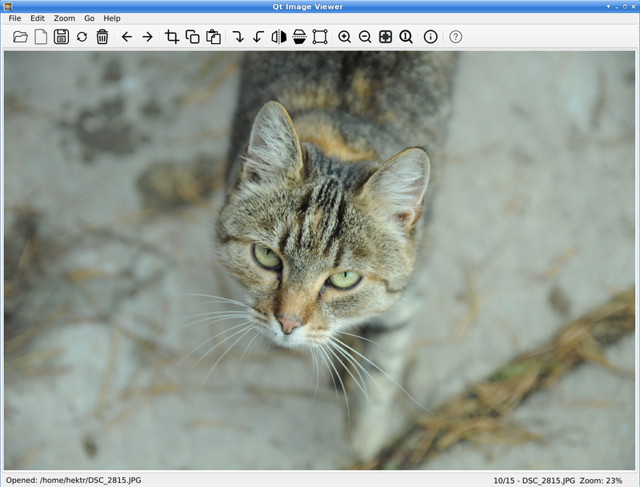
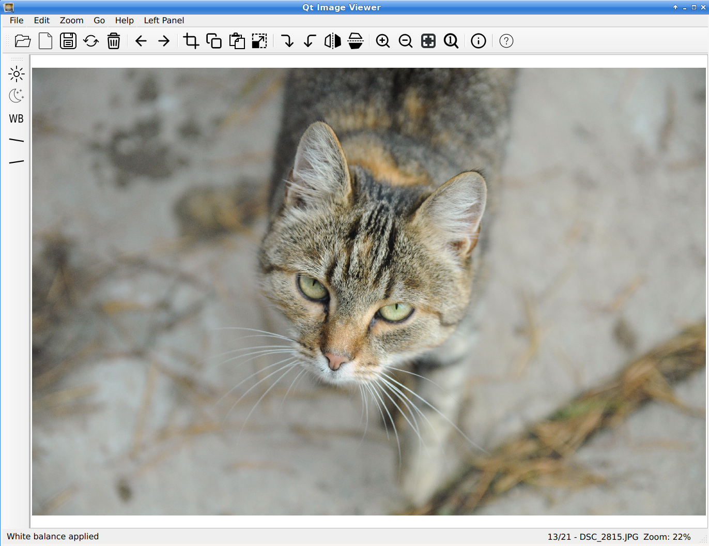

# Qt Image Viewer

A lightweight and fast image viewer and editor built with PySide6, designed for seamless integration into Linux desktop environments.

## Features

- **View photo/screenshots**: JPG/JPEG, WebP, PNG
- **Basic editing**: Rotate, flip, crop, copy/paste, resize 
- **White balance and exposition**: experimental features
- **Quality-controlled saving**: Save JPEGs with adjustable quality (default: 95), no unintended compression
- **Navigation**: Zoom in/out, fit to window, display at original size, and pan with arrow keys or middle mouse button
- **File browsing**: Navigate forward/backward through images in the same folder
- **EXIF metadata**: View image metadata in a dedicated panel

## Development & Deployment

- Built with **PySide6** (Qt6)
- Targeted for Linux; deployed as AppImage

