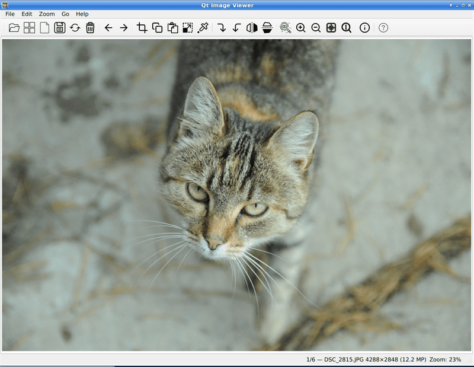
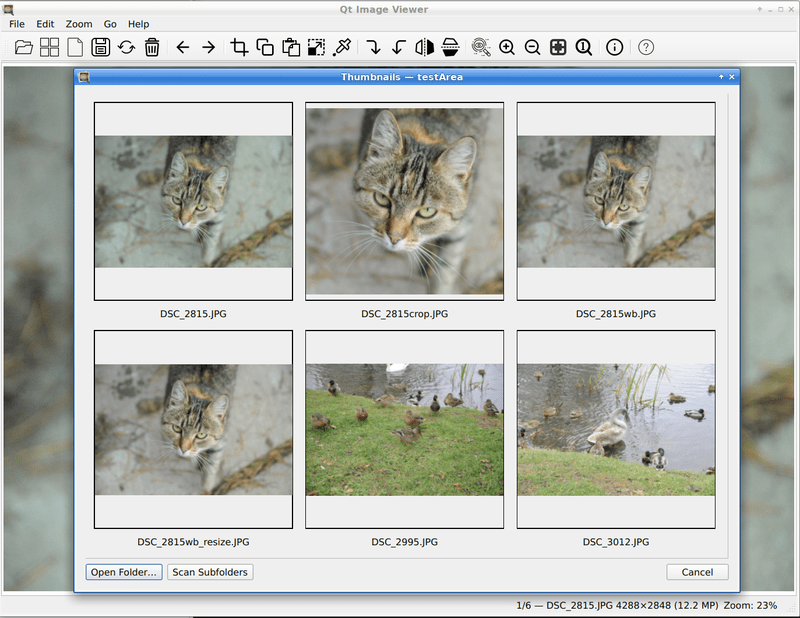

# Qt Image Viewer

Handy image viewer built with PySide6. 
Designed priorly for linux, but the latest version supports also windows 
(tested on windows 10, but should also work on windows 11).

## Features

| Feature                  | Description                                              |
|--------------------------|----------------------------------------------------------|
| **View formats**         | JPG/JPEG, WebP, PNG                                      |
| **Basic editing**        | Rotate, flip, crop, copy/paste, resize                   |
| **White balance**        | Adjust by clicking neutral gray area                     |
| **Loupe tool**           | 1:1 preview under cursor (256×256 px default)            |
| **Quality-controlled saving** | JPEG/WebP with adjustable quality (default: 95)          |
| **Zoom**                 | Zoom, fit-to-window, original size, panning              |
| **File browsing**        | Navigate next/prev image in folder                       |
| **EXIF metadata**        | View in dedicated panel                                  |
| **Thumbnails**           | Open folder → scrollable grid (with caching & threading) |

## Hotkeys

### Navigation & View
| Action                        | Hotkey(s)                     |
|------------------------------|-------------------------------|
| Next / Previous image        | ← → ↑ ↓ or Mouse wheel        |
| Zoom In / Out                | `Ctrl + Wheel` or `+` / `-`   |
| Original size                | `=` or Double-click           |
| Fit to window                | `W` or Right-click            |
| Pan (move image)             | `Ctrl + Arrows` or Middle drag|

### Editing
| Action                      | Hotkey(s)                     |
|-----------------------------|-------------------------------|
| Enter Crop/Selection mode   | `Ctrl+X`                      |
| Apply Crop                  | `Enter`                       |
| Copy selection / full image | `Ctrl+C`                      |
| Paste image                 | `Ctrl+V`                      |
| White Balance               | `B`                           |
| Resize image                | `Ctrl+R`                      |

### Transform
| Action                        | Hotkey(s)                     |
|------------------------------|-------------------------------|
| Rotate 90° CW / CCW          | `R` / `Shift+R`               |
| Flip Horizontal / Vertical   | `F` / `Shift+F`               |

### File & Info
| Action                   | Hotkey(s) |
|--------------------------|-----------|
| Open file                | `Ctrl+O`  |
| Open folder / thumbnails | `Ctrl+T`  |
| Save image               | `Ctrl+S`  |
| Reload image             | `F5`      |
| Move to trash            | `Delete`  |
| Show EXIF                | `I`       |
| About / Help             | `F1`      |

### Cancel
| Action                      | Hotkey(s)            |
|-----------------------------|----------------------|
| Exit any tool (crop, WB...) | `Esc` or Right-click |
| Exit app                    | `Q`                  |

## Development & Deployment

- Built with **PySide6** (Qt6)
- Targeted for Linux; deployed as AppImage

